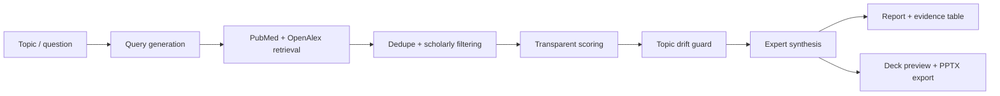

# EzResearch

[](https://github.com/ArjunAdelaide/Science-for-Everyone/actions/workflows/ci.yml)

Academic research intelligence for evidence-grounded reports and presentation-ready decks.

EzResearch turns a research topic, keyword, or question into a cited recent-findings report backed by retrieved scholarly records. It searches PubMed and OpenAlex, filters likely scholarly sources, ranks papers with transparent scoring, runs an optional OpenAI expert-synthesis layer, and produces an auditable report plus a compact deck preview/export.

It is intentionally not a full systematic-review engine. The current product works from public scholarly metadata and abstracts, keeps claims tied to retrieved records, and makes limitations visible.

## Portfolio Snapshot

EzResearch is a portfolio-grade full-stack AI product focused on one hard thing: making research compression trustworthy. It is not just a paper summarizer. The system preserves source metadata, excluded-record reasons, score explanations, abstract-only caveats, and citation links so a reviewer can audit how each claim was produced.

What this project demonstrates:

- full-stack product execution with Next.js App Router and TypeScript
- API integration with PubMed / NCBI E-utilities and OpenAlex
- explainable ranking instead of black-box retrieval
- responsible AI guardrails for citation-grounded synthesis
- report/deck generation from a shared evidence model
- production hygiene: CI, tests, env docs, Netlify config, and deployment notes

## Why This Exists

Academic search tools are powerful, but they often leave users with a long list of papers and little synthesis. Generic summarizers can compress text, but they can also blur provenance or overstate evidence.

EzResearch explores a more trustworthy middle ground:

- retrieve credible scholarly records from public APIs
- filter and rank papers with explainable signals
- generate outputs that preserve citation traceability
- clearly label abstract-only analysis and metadata-inferred peer-review status

## Key Features

- Topic, keyword, or full-question input
- minimal, premium landing page inspired by frontier research lab websites
- PubMed / NCBI E-utilities retrieval
- OpenAlex retrieval with citation counts where available
- DOI/title deduplication
- likely scholarly journal filtering
- optional preprint inclusion
- transparent paper scoring
- OpenAI-powered expert synthesis mode for deeper topic explanation, paper-level insights, and presentation-ready finding slides
- report-first results workspace with compact source context and deck support
- slide-by-slide deck preview with topic primer, scientific findings, implications, caveats, and references
- `.pptx` download flow via `pptxgenjs`, including a visible ready-state link after generation
- explicit demo fallback records when live APIs fail, controlled by env var

## Demo Workflow

1. Start from the landing page and enter a topic such as `AlphaFold`, `CRISPR delivery methods`, `quantum physics`, or `glioblastoma immunotherapy`.
2. Generate the research intelligence package.
3. Read the recent-findings report as the primary output.
4. Review sources, excluded records, methodology, and score explanations to audit the result.
5. Preview or download the editable PowerPoint deck when a presentation artifact is needed.

## What Makes It Different From ChatGPT Search

EzResearch is built around a repeatable evidence pipeline rather than a single chat answer:

- sources are retrieved from scholarly APIs before synthesis
- papers are deduplicated, filtered, and ranked before generation
- every major finding cites retrieved paper IDs
- excluded papers and warnings remain visible
- analysis scope is labelled as abstract-and-metadata only
- strict expert mode can fail closed instead of returning a weak fallback

The goal is not to replace expert review. The goal is to give a user a fast, auditable first-pass research package.

## Tech Stack

- Next.js 16 App Router
- React 19
- TypeScript
- Tailwind CSS
- PubMed / NCBI E-utilities
- OpenAlex
- pptxgenjs
- Vitest

## Architecture

```text
app/
  api/research/route.ts          # JSON research package endpoint
  api/research/deck/route.ts     # PPTX export/link-generation endpoint
  api/research/deck/download/    # short-lived server-backed PPTX download URL
  page.tsx                       # client-side workflow shell

components/research/
  LandingHero.tsx
  DeckPreview.tsx
  LoadingState.tsx
  types.ts

lib/
  research/
    validation.ts                # request parsing, bounds, fallback config
    runResearch.ts               # pipeline orchestration
  scholarly/
    pubmed.ts                    # PubMed retrieval and normalization
    openalex.ts                  # OpenAlex retrieval and normalization
    dedupe.ts                    # DOI/title dedupe
    filter.ts                    # likely scholarly filtering
    query.ts                     # keyword extraction and search queries
    mockPapers.ts                # labelled demo fallback records
  scoring/
    paperScore.ts                # transparent ranking model
  synthesis/
    briefGenerator.ts            # Markdown report
    deckPreview.ts               # structured consulting-style slide preview model
    deckGenerator.ts             # text deck outline
    expertSynthesis.ts           # optional OpenAI expert-agent synthesis layer
    deckDownloadStore.ts         # temporary in-memory download link store
    pptxGenerator.ts             # PowerPoint export
  types/
    paper.ts                     # shared domain types
```

The app keeps retrieval, filtering, scoring, synthesis, UI, and export boundaries separate without adding a heavy framework.

## Pipeline



## Code Worth Reviewing

- [`lib/research/runResearch.ts`](./lib/research/runResearch.ts) orchestrates retrieval, filtering, ranking, topic drift checks, synthesis, and output generation.
- [`lib/synthesis/expertSynthesis.ts`](./lib/synthesis/expertSynthesis.ts) contains the OpenAI-backed research-agent layer, citation ID mapping, strict-mode behavior, and response sanitization.
- [`lib/scoring/paperScore.ts`](./lib/scoring/paperScore.ts) implements the transparent ranking model.
- [`components/research/ResearchReport.tsx`](./components/research/ResearchReport.tsx) renders the report-first output workspace.
- [`tests/pipeline.test.ts`](./tests/pipeline.test.ts) covers high-risk pipeline behavior, including topic drift and expert fallback boundaries.

## Scoring Methodology

Each paper receives a 0-100 score using visible components:

| Signal | Weight | What It Means |
|---|---:|---|
| Relevance | 50% | Keyword overlap across title, abstract, source, and publication type |
| Recency | 18% | Publication year within the selected date range |
| Evidence type | 24% | Publication metadata such as review, meta-analysis, clinical trial, or journal article |
| Citations | 8% | OpenAlex citation count when available |

Weak topical overlap receives an additional discount so highly cited but off-topic papers do not dominate.

This is deliberately simple and auditable. It is not a black-box ranking model.

## Safety and Limitations

EzResearch is designed to be transparent about what it can and cannot support:

- Analysis is abstract-and-metadata only.
- Full text, PDFs, figures, supplementary data, and detailed methods are not yet parsed.
- Peer-review status is inferred from source/publication metadata and should not be treated as guaranteed.
- Generated claims come only from retrieved abstracts and metadata.
- The evidence table links every claim to retrieved paper records.
- Demo fallback records are labelled and can be disabled.

For high-stakes academic, clinical, investment, or policy use, outputs should be treated as a starting point for expert review.

## Data Sources

### PubMed / NCBI E-utilities

Used for biomedical article search, publication type metadata, journal metadata, DOI metadata, and abstracts when available.

### OpenAlex

Used for broad scholarly search, reconstructed abstracts where available, source metadata, DOI metadata, and citation counts.

## Environment Variables

Copy `.env.example` to `.env.local` if desired:

```bash
NCBI_API_KEY=
NCBI_EMAIL=
NCBI_TOOL=EzResearch
OPENALEX_MAILTO=
OPENAI_API_KEY=
OPENAI_RESEARCH_MODEL=gpt-4.1-mini
OPENAI_EXPERT_TIMEOUT_MS=25000
EZRESEARCH_ENABLE_EXPERT_SYNTHESIS=false
EZRESEARCH_REQUIRE_EXPERT_SYNTHESIS=false
EZRESEARCH_ENABLE_MOCK_FALLBACK=true
```

Notes:

- PubMed and OpenAlex can work without keys for the MVP.
- NCBI recommends setting an email/tool name.
- `NCBI_API_KEY` improves NCBI rate limits.
- `OPENAI_API_KEY` powers the expert synthesis layer.
- `OPENAI_RESEARCH_MODEL` controls the model used for expert synthesis. The default favors speed for portfolio demos.
- `OPENAI_EXPERT_TIMEOUT_MS` caps expert synthesis latency.
- Set `EZRESEARCH_ENABLE_EXPERT_SYNTHESIS=true` to run the expert research-agent layer.
- Set `EZRESEARCH_REQUIRE_EXPERT_SYNTHESIS=true` when quality matters more than fallback behavior. In this mode, EzResearch fails closed if the model is unavailable instead of producing a weaker deterministic report.
- Keep `EZRESEARCH_ENABLE_EXPERT_SYNTHESIS=false` for fast UI-only demos without OpenAI latency.
- Set `EZRESEARCH_ENABLE_MOCK_FALLBACK=false` for strict live-data-only behavior.

## Deploying to Netlify

EzResearch includes a `netlify.toml` for the default deploy path:

```text
Build command: npm run build
Publish directory: .next
Node version: 22
```

Recommended flow:

1. Push this repository to GitHub.
2. In Netlify, choose **Add new site** -> **Import an existing project**.
3. Connect the GitHub repository.
4. Add optional environment variables from `.env.example`.
5. Deploy.

Because EzResearch uses Next.js API routes for research and PPTX generation, use a Git-connected Netlify deploy rather than dragging the folder into Netlify as a static site.

### Deployment Note: PPTX Downloads

The current MVP supports two deck export paths:

- direct binary response from `POST /api/research/deck`
- link-based response from `POST /api/research/deck?delivery=link`, followed by a short-lived `GET /api/research/deck/download?id=...`

The link-based path uses an in-memory store with a 15-minute expiry. That is acceptable for local demos and simple portfolio hosting, but it is not a durable storage design for multi-instance serverless production. A production version should store generated decks in object storage such as S3/Supabase Storage, or fall back to client-side blob downloads without a server-held temporary file.

## Local Setup

```bash
npm install
npm run dev
```

Open `http://localhost:3000`.

## Scripts

```bash
npm run dev        # start local dev server
npm run lint       # ESLint
npm run typecheck  # TypeScript
npm test           # Vitest unit tests
npm run build      # production build
```

## Testing

The test suite focuses on pure business logic:

- query generation
- request validation
- deduplication
- filtering
- scoring
- evidence table and brief generation
- deck slide generation
- deck download link expiry
- expert synthesis fallback boundaries
- topic drift protection for broad queries

Run:

```bash
npm test
```

CI runs lint, typecheck, tests, and build on every push to `main` and every pull request.

## Screenshots

Recommended screenshot set before sharing broadly:

- Landing page with local archival research backdrop and minimal search input.
- Generated report workspace showing the topic primer and first findings.
- Sources column showing citation auditability and excluded-record reasons.
- Deck preview showing a compact presentation-ready slide.
- Downloaded PowerPoint deck opened in PowerPoint, Keynote, or Google Slides.

The landing page uses local archival-style image assets so the first viewport does not depend on third-party image CDNs during demos.

## Case Study

### Product Problem

Researchers, students, analysts, and operators often need a fast evidence scan, but scholarly search results are hard to convert into a decision-ready artifact. The risk is either manual overload or opaque summarization.

### Solution

EzResearch turns a topic into an auditable research package: source retrieval, filtering, scoring, citation-grounded synthesis, a recent-findings report, deck preview, and PPTX export. The product optimizes for trust over flash.

### Engineering Decisions

- Used Next.js App Router for a compact full-stack MVP.
- Kept OpenAI synthesis configurable so local/demo runs can choose between speed and strict expert mode.
- Built scoring as transparent TypeScript rather than a black-box ranker.
- Preserved excluded records and warning states for auditability.
- Added topic-drift protection so broad searches do not get hijacked by niche but technically related papers.
- Used short model-facing citation IDs and mapped them back to source records to keep generated claims auditable.
- Added focused unit tests around the highest-risk pure logic.

### Current Impact

The MVP can take a broad or specific topic and produce a working research artifact in one flow. It demonstrates the core product thesis: research AI should not only sound fluent, it should show its work.

## Future Improvements

- add checked-in screenshots or a short demo GIF to this README
- add object storage for generated deck downloads in serverless production
- Semantic Scholar, Crossref, Europe PMC, and Unpaywall connectors
- PDF/full-text parsing with section-aware extraction
- BibTeX/RIS export
- stronger claim clustering across multiple papers
- persistent project history with SQLite/Postgres/Supabase
- richer PPTX themes and chart/table slides
- browser-based report export to PDF

## Repo Hygiene

The repository is configured for GitHub publication:

- MIT license is included.
- CI runs lint, typecheck, tests, and build on pushes and pull requests.
- Node `22` is documented in `.nvmrc`, `package.json`, CI, and Netlify config.
- `.gitignore` excludes `.env.local`, `.next/`, `node_modules/`, generated `.pptx` files, logs, coverage, and TypeScript build metadata.
- `.env.example` documents public API configuration and strict expert-synthesis mode.

Avoid committing `.env.local`, `.next/`, `node_modules/`, generated `.pptx` files, or local build artifacts.
